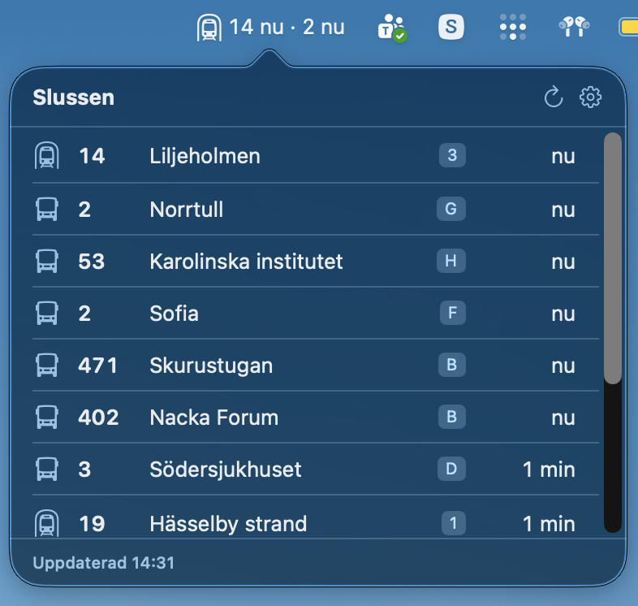
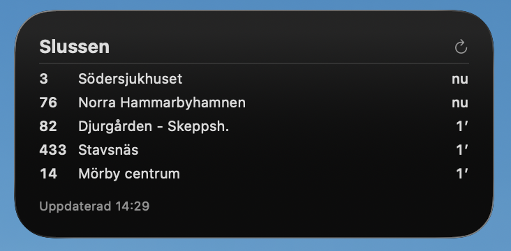

# SL Departures — a macOS menu bar app and desktop widget

Live departure times for a Stockholm public transport stop, in the macOS menu
bar and on the desktop.

Click the menu bar item and you get the full board: line, destination, berth,
minutes left, cancellations, and any service messages for the station — plus a
searchable stop picker, so you never have to look up a stop id by hand.

<p>
  
  
</p>

This is a macOS port of [sl-departures-widget](https://github.com/henrrrik/sl-departures-widget),
an Omarchy bar widget. The model — the parsing, the filters, the clock
anchoring — is the same design in Swift; the UI is native.

It reads SL's open [Transport API](https://www.trafiklab.se/api/trafiklab-apis/sl/transport/),
which needs no account and no API key.

## Install

Needs Xcode and [XcodeGen](https://github.com/yonaskolb/XcodeGen)
(`brew install xcodegen`).

```bash
git clone https://github.com/henrrrik/sl-departures-widget-mac.git
cd sl-departures-widget-mac
make install
```

That builds, copies the app to `~/Applications`, registers it so the widget
appears in the widget gallery, and launches it. Then click the menu bar item and
pick your stop.

To add the desktop widget: right-click the desktop → **Edit Widgets** → search
for "SL Departures", drop it in, then right-click it → **Edit Widget** to choose
a stop.

### Uninstall

Quit the app, then delete `~/Applications/SL Departures.app`. The only other
things it creates are `~/Library/Application Support/io.github.henrrrik.sl-departures/`
(settings) and `~/Library/Caches/io.github.henrrrik.sl-departures/` (the stop
list), both safe to delete.

## Using it

| Action | What it does |
|---|---|
| Left click | Open / close the departure board |
| Right click | Refresh now |
| Middle click | Open stops and settings |
| `r` | Refresh (board open) |
| `s` | Stops and settings (board open) |
| `j` / `k`, arrows | Scroll the board |
| `Esc` | Close the board |

The board refreshes every 30 seconds and counts down continuously between
fetches, so the minutes stay honest. A failed refresh leaves the last board on
screen rather than blanking it.

The interface follows your macOS language: English, or Swedish on a Swedish
Mac. That covers the widget and its edit sheet too — down to the words the
model writes itself, like `nu` for a departure leaving within the minute.

## Configuration

Everything is in the settings window, and also in a plain file at
`~/Library/Application Support/io.github.henrrrik.sl-departures/settings.json`,
which is watched — edits apply without a restart.

```json
{
  "stops": [
    {
      "siteId": 9192,
      "siteName": "Slussen",
      "transport": "METRO",
      "direction": 1,
      "lines": "13, 14",
      "walkMinutes": 5,
      "barCount": 2,
      "panelCount": 12,
      "forecastMinutes": 90,
      "refreshIntervalSec": 30,
      "barFormat": "{line} {wait}",
      "showIcon": true
    }
  ]
}
```

| Key | Default | What it does |
|---|---|---|
| `siteId` | – | The SL site to watch. Set by the picker; `sl-departures search <name>` finds it too. |
| `siteName` | – | Display name. On its own (no `siteId`) it is resolved to an id and written back. |
| `transport` | all | `BUS`, `METRO`, `TRAM`, `TRAIN`, `SHIP`, or `FERRY`. |
| `direction` | both | `1` or `2` — SL's direction codes for the stop. |
| `lines` | all | Comma-separated line designations, e.g. `"4, 74"`. |
| `walkMinutes` | `0` | Hides departures leaving sooner than this, so the board only shows what you could still catch. |
| `barCount` | `2` | Departures shown in the menu bar. |
| `panelCount` | `12` | Departures shown in the popup. |
| `forecastMinutes` | `90` | How far ahead to ask for. |
| `refreshIntervalSec` | `30` | Seconds between fetches (minimum 15). |
| `barFormat` | `{line} {wait}` | Template per departure. Tokens: `{line}` `{wait}` (`4′` / `now`) `{min}` (bare number) `{clock}` `{destination}` `{display}`. |
| `showIcon` | `true` | Mode icon in front of the menu bar label. |

Add a second entry and you get a second menu bar item — home and work side by
side. Stops sharing a site and filters share one request, however many menu bar
items show them.

### From the terminal

```bash
swift run sl-departures search gullmars     # 9189  Gullmarsplan
swift run sl-departures board 9189 METRO    # what is leaving right now
swift run sl-departures bar 9189            # the menu bar label for that stop
swift run sl-departures refresh             # re-download the stop list
```

Useful for checking what the menu bar is claiming against the API by hand.

## How it works

| Path | Role |
|---|---|
| `Sources/SLKit/` | All parsing, filtering and formatting. Foundation only — no AppKit, no SwiftUI. |
| `Sources/sl-departures/` | The terminal helper. |
| `App/` | The menu bar app: status items, the shared fetch hub, the popover, settings. |
| `Widget/` | The WidgetKit extension: configuration intent, timeline provider, tile. |
| `project.yml` | XcodeGen spec for the two bundles. The `.xcodeproj` is generated. |
| `Design/`, `Tools/` | The README screenshots, the app icon’s source artwork, and the script that lays it out on Apple's icon grid — `make icon` redraws every size. |

### Shared fetching

Every status item subscribes to a `StopStream` keyed by its departures URL —
which already encodes the site and every filter the API applies server-side. Two
stops on the same site and filters therefore cost one request between them,
because the per-item settings (`barCount`, `lines`, `walkMinutes`, `barFormat`)
are applied when a view renders the snapshot, not when it is fetched.

### Clock anchoring

SL returns departure times as naive `Europe/Stockholm` wall-clock strings, so
subtracting the machine's clock is only correct on a machine set to Stockholm.
Instead the app anchors itself to SL's own clock: a departure that reports both
`"4 min"` and an absolute `expected` time pins down what "now" was when the
server answered. The median across every such departure becomes the offset
applied to the real clock, and it is kept across fetches — so the countdown is
right on a laptop in any timezone, and keeps ticking between fetches. An offset
larger than any timezone could explain is refused as a garbage anchor.

### The widget's refresh budget

WidgetKit renders timeline entries for free but budgets how often it will wake
an extension to fetch — on the order of once every 15 minutes or worse. So a
single fetch is expanded into one entry per minute for the next 25: the tile
counts down correctly the whole time, departed services drop off, and the ones
behind them slide up. A reload buys *new* information — a cancellation, a delay
— not the arithmetic.

Two things push against the budget: the app calls
`WidgetCenter.reloadTimelines` after each of its own fetches, which the system
treats far more favourably than a reload the timeline asks for, and the tile's
refresh button is user-initiated and so effectively exempt. Neither makes the
widget live; the menu bar app is the live surface.

The widget carries its own stop in its configuration and fetches for itself
rather than reading anything the app wrote. That is deliberate: sharing state
would mean an App Group entitlement, and this way the project needs no
provisioning profile at all.

## Development

```bash
make test      # the model, with no Xcode in the loop
make build     # regenerate the project and build both bundles
make install   # build, install to ~/Applications, register, launch
make run       # build and launch in place
```

`project.yml` is the source of truth; `SLDepartures.xcodeproj` is generated and
gitignored, so `make gen` after changing a target or a build setting.

`Sources/SLKit` deliberately imports nothing but Foundation — the same bet the
Omarchy widget made by keeping `Model.js` free of QML types — so the clock
anchoring, the filters and the formatting are all exercised by `swift test`
without a bundle, a signature, or a running UI.

## License

MIT — see [LICENSE](LICENSE).

Departure data comes from SL via [Trafiklab](https://www.trafiklab.se/); this
project is not affiliated with or endorsed by SL or Region Stockholm. The app
icon is original artwork — it is not SL's logo, or any other mark of theirs.
